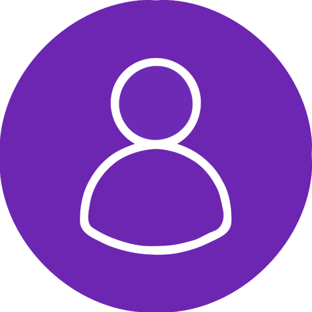

#  User Registration System


> Full-stack user management application developed by **Patricia Gea** at **Hyper Island, Stockholm**


A modern web app for managing user registrations built with React, Node.js, and MongoDB featuring a responsive design, real-time notifications, and accessibility-first approach.

---

## Table of Contents

- [Features](#-features)
- [Technologies](#-technologies)
- [Quick Start](#-quick-start)
- [API Documentation](#-api-documentation)
- [Project Structure](#-project-structure)
- [Accessibility & SEO](#-accessibility--seo)
- [Learning Outcomes](#-learning-outcomes)

---

## Features

**Core Functionality**
- Create, search, display, and delete user records
- Real-time notifications with visual feedback
- Form validation with error handling

**User Experience**
- Fully responsive (desktop, tablet, mobile)
- Modern UI with smooth animations
- Smart search with result counting
- Live notifications for all actions

**Technical**
- RESTful API with CRUD operations
- Clean component architecture with React Hooks
- Asynchronous data fetching and error handling

---

## Technologies

**Frontend:** React 19.2.0 | Vite 7.3.1 | Axios | CSS3 | HTML5  
**Backend:** Node.js | Express.js 4.22.1 | MongoDB | Mongoose 8.22.1  
**Tools:**  Git

---

## Quick Start

### Prerequisites
- Node.js (v14+) | MongoDB | npm

### Installation

```bash
# Clone and setup project
git clone <repository-url>

# Frontend
npm install

# Backend
cd api_users
npm install
```

### Configuration

Create `.env` in `api_users/`:
```env
MONGODB_URI=mongodb://localhost:27017/usersdb
PORT=3000
```

### Running

```bash
# Terminal 1 - Backend
cd api_users
npm start
# Runs on http://localhost:3000

# Terminal 2 - Frontend
npm run dev
# Runs on http://localhost:5173
```

### Build
```bash
npm run build  # Frontend
npm run preview
```

---

## API Documentation

**Base URL:** `http://localhost:3000`

| Method | Endpoint | Description |
|--------|----------|-------------|
| GET | `/users` | Get all users or search with query params |
| GET | `/users?name=X&email=Y&age=Z` | Search users by fields |
| POST | `/users` | Create new user |
| DELETE | `/users/:id` | Delete user |

**Response Codes:** 200 (Success) | 201 (Created) | 400 (Bad Request) | 404 (Not Found) | 500 (Server Error)

---

## Project Structure

```
devClubCadastrouser/
├── api_users/                 # Backend API
│   ├── models/user.js        # User model
│   ├── routes/users.js       # API endpoints
│   ├── db.js                 # Database setup
│   ├── server.js             # Express server
│   ├── package.json
│   └── .env
│
├── src/                      # Frontend
│   ├── pages/Home/
│   │   ├── index.jsx         # Main component
│   │   └── style.css
│   ├── services/api.js       # Axios config
│   ├── assets/
│   ├── main.jsx
│   └── index.css
│
├── index.html
├── package.json
└── vite.config.js
```

---

## Accessibility & SEO

### Accessibility (WCAG 2.1 AA)
- Semantic HTML (`<form>`, `<section>`, `<article>`)
- ARIA labels and live regions for announcements
- Full keyboard navigation support
- Screen reader optimized
- High contrast (white on dark purple)
- Min font size 13px, touch-friendly buttons (45px)
- Form validation with clear error messages

### SEO Optimization
- Descriptive meta tags & description
- Open Graph & Twitter Card meta tags
- Mobile-friendly responsive design
- Fast load times (Vite optimization)
- Semantic HTML structure

### Testing Tools
- WAVE Browser Extension
- axe DevTools
- Chrome Lighthouse (target: 95+ accessibility, 100 SEO)
- Screen readers: NVDA, JAWS, VoiceOver

---

## Learning Outcomes

- **Full-Stack Development:** Frontend-backend integration, RESTful APIs, database modeling
- **React:** Component architecture, Hooks, state management, form handling
- **Backend:** Express.js, MongoDB/Mongoose, CRUD, error handling
- **Web Standards:** Responsive design, accessibility (a11y), SEO, modern CSS
- **Professional:** Code organization, documentation, version control, deployment

---

<div align="center">

  <p>Portfolio • LinkedIn • GitHub • Email</p>
</div>
